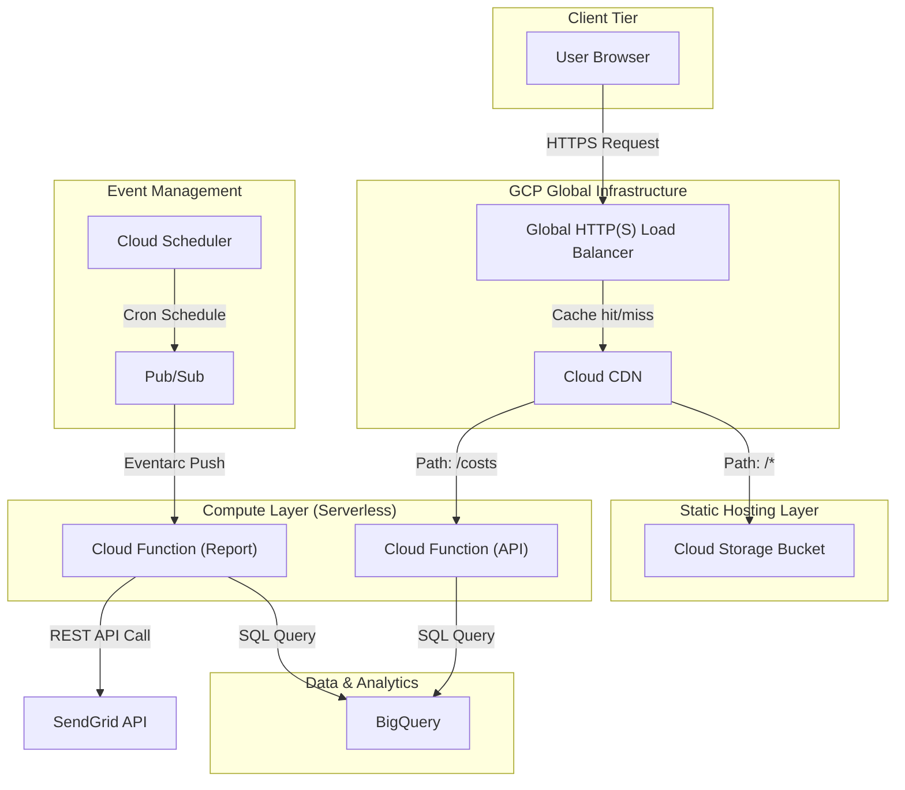

# Architecture Decision Record (ADR)

## Context
The goal of this project was to migrate an existing cloud cost calculation and alerting system from AWS to Google Cloud Platform (GCP). The system must provide a dashboard for cost visibility, issue alerts when spending limits are breached, and send automated weekly cost summaries via email. The infrastructure must be fully automated, secure, and cost-effective (ideally serverless).

## Decisions

### 1. Compute & API Backend
*   **Decision:** Use Cloud Functions (2nd Gen)
*   **Alternatives Considered:** Cloud Run (custom containers), App Engine, Compute Engine (VMs).
*   **Rationale:** Cloud Functions Gen2 are built on top of Cloud Run and Eventarc, providing the perfect balance of "code-only" deployments without needing to write Dockerfiles, while still getting the concurrency and larger instance sizes of Cloud Run. The scale-to-zero capability ensures that we pay absolutely nothing when the dashboard or weekly report is not being triggered.

### 2. Frontend Hosting & CDN
*   **Decision:** Cloud Storage (static hosting) + External Application Load Balancer + Cloud CDN
*   **Alternatives Considered:** Firebase Hosting, App Engine.
*   **Rationale:** Cloud Storage provides a highly durable, zero-maintenance object store for static assets (HTML/JS/CSS). Fronting it with a Global Load Balancer and Cloud CDN allows us to cache the assets at the edge, reducing latency globally and protecting the origin bucket. It also provides a single Anycast IP address to route traffic to both the static assets (via backend bucket) and the Cloud Function API (via serverless NEG).

### 3. Cost Data Source
*   **Decision:** BigQuery (Cloud Billing Export)
*   **Alternatives Considered:** Cloud Billing REST API.
*   **Rationale:** The Cloud Billing REST API does not provide granular, per-service daily cost breakdowns dynamically. By exporting billing data to BigQuery, we can use standard SQL to perform advanced analytics, filter out microscopic costs, sum credits dynamically, and group by specific time intervals.

### 4. Alerting & Email
*   **Decision:** Native GCP Budgets (for thresholds) + SendGrid (for custom reports)
*   **Alternatives Considered:** Compute Engine SMTP relays, Amazon SES.
*   **Rationale:** GCP does not have a native email-sending service equivalent to AWS SES. For native threshold alerts (50%, 80%, 100%), GCP Budgets natively integrate with Cloud Monitoring Notification Channels to send basic emails. For our stylized weekly summary report, we use SendGrid via a REST API call from a Cloud Function, as it is the industry standard for reliable transactional email delivery on GCP.

### 5. Authentication & Security
*   **Decision:** Workload Identity Federation (WIF)
*   **Alternatives Considered:** Service Account JSON Keys stored in GitHub Secrets.
*   **Rationale:** Storing long-lived cryptographic keys in third-party CI/CD systems is a security anti-pattern. WIF allows GitHub Actions to authenticate to GCP dynamically using OpenID Connect (OIDC) tokens, eliminating the risk of credential leakage.

## Current State Architecture Map

## Consequences
*   **Positive:** Highly scalable, zero-maintenance, virtually free to run, secure by default.
*   **Negative:** BigQuery billing export introduces a slight delay (costs are not real-time to the minute, usually delayed by a few hours). We also have an external dependency on SendGrid for the custom weekly emails.
